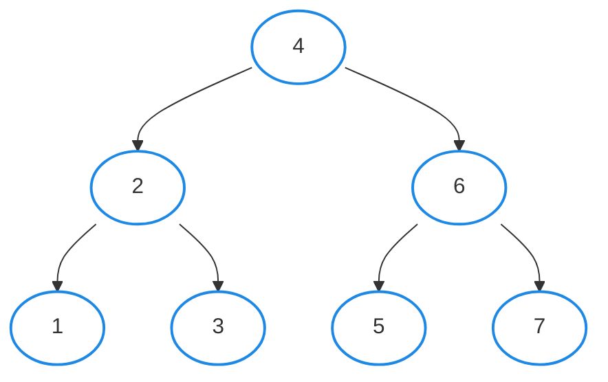

```mermaid
graph TD;
    A["4"] --> B["2"];
    A --> C["6"];
    B --> D["1"];
    B --> E["3"];
    C --> F["5"];
    C --> G["7"];

    classDef circleNode stroke:#1E88E5,fill:#FFFFFF,stroke-width:2px,rx:50px,ry:50px;
    class A,B,C,D,E,F,G circleNode;
```
